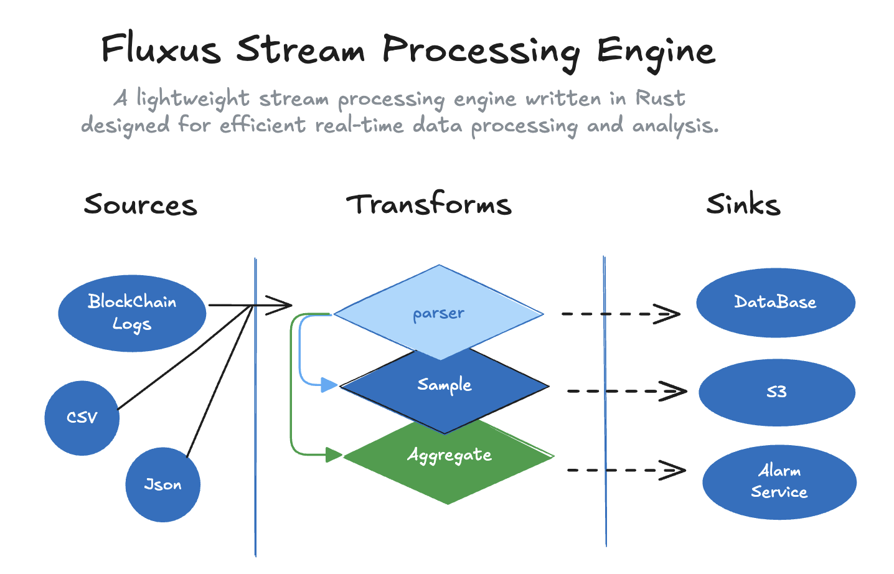

# Fluxus Stream Processing Engine

[](https://crates.io/crates/fluxus-core)
[](https://docs.rs/fluxus-core)
[](https://opensource.org/license/apache-2-0)
[](https://github.com/lispking/fluxus/actions?query=branch%3Amain)


Fluxus is a lightweight stream processing engine written in Rust, designed for efficient real-time data processing and analysis.



## Features

- High-performance stream processing
- Flexible windowing operations (Tumbling, Sliding, Session windows)
- Parallel processing support
- Rich set of stream operations (map, filter, aggregate)
- Type-safe API
- Easy to use and extend

## Project Structure

- `crates/fluxus-api` - Core API definitions and interfaces
- `crates/fluxus-core` - Core implementations and data structures
- `crates/fluxus-runtime` - Runtime engine and execution environment
- `examples` - Example applications demonstrating usage

## Examples

The project includes several example applications that demonstrate different use cases:

### Word Count

Simple word frequency analysis in text streams using tumbling windows.

```bash
cargo run --example word-count
```

### Temperature Sensor Analysis

Processing and analyzing temperature sensor data with sliding windows.

```bash
cargo run --example temperature-sensor
```

### Click Stream Analysis

Analyzing user click streams with session windows.

```bash
cargo run --example click-stream
```

### Network Log Analysis

Processing network logs with sliding windows and aggregations.

```bash
cargo run --example network-log
```

### View Available Examples

To see all available examples and options:

```bash
cargo run --example
```

## Getting Started

1. Clone the repository:

```bash
git clone https://github.com/lispking/fluxus.git
cd fluxus
```

2. Build the project:

```bash
cargo build
```

3. Run the examples:

```bash
cargo run --example [example-name]
```

## Development

### Prerequisites

- Rust 1.75+ 
- Cargo 

### Building

```bash
cargo build
```

### Testing

```bash
cargo test
```

## License

This project is licensed under the Apache License 2.0 - see the [LICENSE](LICENSE) file for details.